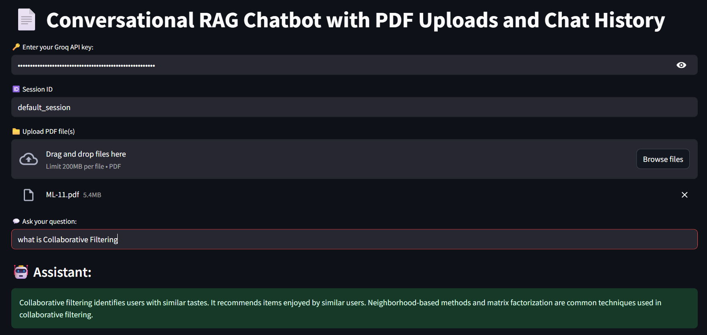
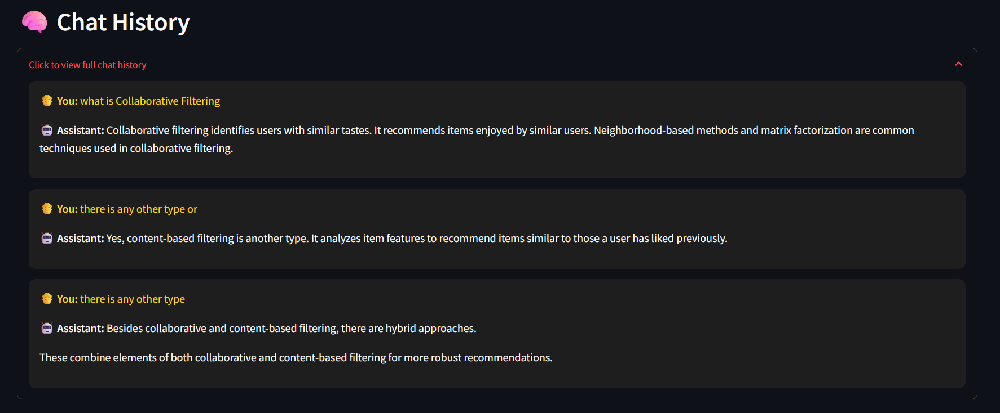

# 🧠 PDF RAG Chatbot with Groq LLM & Chat History

This is a **PDF-based RAG (Retrieval-Augmented Generation)** chatbot that lets you:
- Upload a PDF
- Embed its contents into a vector store
- Ask questions about the content
- Get intelligent responses powered by **Groq LLM**
- View and maintain full **chat history** within the session

---

## 🚀 How It Works

### 1. Upload PDF
- Users can upload any PDF document into the Streamlit app.

### 2. Text Chunking
- The PDF is split into small text chunks using LangChain's text splitter.
- This allows better handling for large documents.

### 3. Embedding
- Each chunk is embedded using:
```python
HuggingFaceEmbeddings(model_name="all-MiniLM-L6-v2")
```
- The embedding model converts text into numerical vectors that capture semantic meaning.

### 4. Vector Storage with ChromaDB
- All the embeddings are stored in a local vector store using ChromaDB.
- This creates a folder called: ` chroma_store/ `
- The system can later retrieve the most relevant chunks based on user queries.

### 5. Question Answering
- Users can now ask natural language questions based on the PDF content
- The app retrieves the most relevant embedded chunks and sends them, along with the query, to the LLM.

### 6. Answer with Groq LLM
- Groq’s large language model generates an intelligent and context-aware response.
- This is done via Groq’s web integration.

### 7. Chat History
- The conversation (questions and answers) is maintained during the session.
- Each new question uses previous context to improve coherence.

---

## Some Screenshot of Work



---


